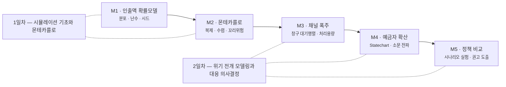

# AnyLogic 시뮬레이션 교육 (5시간) — 커리큘럼 설계

대학이 주관하는 **독립 특강·워크숍** 형태로, 금융회사 실무자가 학교 강의실에서 수강하는 **AnyLogic 시뮬레이션 입문 과정(총 5시간, 2.5시간 × 2회)** 의 커리큘럼 설계 문서 모음입니다.

하나의 러닝 케이스 — **뱅크런(예금인출 쇄도)** — 를 5시간 내내 단계적으로 키워가며, 시뮬레이션의 기초와 몬테카를로에서 출발해 위기 대응 의사결정까지 도달합니다.

> **이 저장소의 산출물은 설계 문서입니다.** 실습 모델 파일(`.alp`), 슬라이드, 워크북 실물은 이 단계에서 만들지 않습니다.
> 대신 그것들을 *무엇을, 어떤 순서로, 어떤 사양으로* 만들어야 하는지를 확정해 — 교육담당자가 검토·승인할 수 있고 제작자가 그대로 만들 수 있는 수준의 설계서를 제공합니다.

---

## 과정 한눈에 보기

| 항목 | 내용 |
|---|---|
| 과정명 | 금융 위기 상황 시뮬레이션 입문 — 뱅크런으로 배우는 AnyLogic |
| 대상 | 금융회사 실무자 (리스크관리·채널전략·운영기획·영업지원) |
| 주관·장소 | 대학 주관 독립 특강 · **학교 전산실** |
| 선수지식 | **없음.** 엑셀 사용 경험만 전제. AnyLogic·프로그래밍 경험 불필요 |
| 총 시간 | 5시간 = 2.5시간 × 2회 |
| 권장 정원 | 12~16명 (강사 1 + 조교 2) |
| 도구 | AnyLogic **8.9.x 데스크톱**, **PLE(무료판)** |
| 러닝 케이스 | 뱅크런·예금인출 쇄도 (가상 은행) |

---

## 5시간 동안 하나의 모델이 자라는 방식

| 단계 | 답하는 질문 | 새로 배우는 것 |
|---|---|---|
| **M1** | 위기 당일 인출액은 얼마나 나올까? | 확률변수, 분포 선택, 난수와 시드 |
| **M2** | 유동성이 바닥날 확률은? | 복제, 수렴, 신뢰구간, **꼬리위험** |
| **M3** | 창구가 그 인출을 감당할 수 있나? | 대기행렬, 자원(창구직원), 포기율 |
| **M4** | 불안은 어떻게 번지고 언제 폭발하나? | 에이전트, 상태도, 확산 동학 |
| **M5** | 무엇을 하면 막을 수 있나? | 시나리오 비교, 정책 권고 |

---

## 이 과정의 중심 통찰

두 실제 사례를 나란히 놓으면 교육의 주제가 저절로 섭니다.

- **SVB (2023-03)** — 앱·디지털 채널. 물리적 대기줄이 없으니 **하루 만에 $42B 인출 시도**가 몰렸고, 마감 시 현금잔액이 **-$958M** 이 되었습니다.
- **새마을금고 (2023-07)** — 대면 창구 중심. 지점 처리용량이 물리적 병목으로 작동했고, 한 달간 예·적금 중도해지가 **41만 7,367건**(전년 동기의 2배)이었습니다.

> **채널 구성과 처리용량이 위기 전개 속도를 결정한다.**

이것이 모델이 답해야 할 질문이고, 대면 창구·앱·콜센터를 각각 모델링해 대응책을 비교하는 실습 전체의 뼈대입니다.

---

## 문서 구성

| 문서 | 내용 | 주 독자 |
|---|---|---|
| [01 · 과정 개요](docs/01-course-overview.md) | 배경·대상·선수지식·**학습목표와 도달 수준(L1/L2/L3)**·범위 밖 선언 | 교육담당자 |
| [02 · 상세 시간표](docs/02-schedule.md) | 1·2일차 분 단위 타임테이블, Go/No-Go 분기점, 분할 운영 대안 | 강사·교육담당자 |
| [03 · 러닝 케이스 사양](docs/03-running-case.md) | 뱅크런 시나리오, M1~M5 모델 스펙, 파라미터, KPI | 모델 제작자 |
| [04 · 실습·교재 사양](docs/04-labs-and-materials.md) | **사전 제공 vs 학습자 작업 대조표**, 배포 파일 목록, 제작 일정 | 모델 제작자·강사 |
| [05 · 운영과 라이선스](docs/05-operations-and-license.md) | 사전 준비, **전산실 환경**, **PLE 라이선스 정책**, 리스크 레지스터 | 교육담당자·주관 학과 |
| [06 · 평가와 후속](docs/06-assessment-and-followup.md) | 체크포인트, 추적표, 루브릭, 설문, 후속 학습 경로 | 교육담당자 |
| [07 · PLE 제약 검증 프로토콜](docs/07-ple-verification.md) | **착수 전 필수 검증 T1~T4**, 트랙 A/B 결정 규칙 | 모델 제작자 |
| [08 · 강사 런북](docs/08-instructor-runbook.md) | **블록별 발화 스크립트**, 예상 실수와 복구, FAQ, 비상 절차 | 강사·조교 |

### 교보재 (배포용 실물)

| 자료 | 사용 시점 |
|---|---|
| [확률분포 선택 치트시트](docs/handouts/distribution-cheatsheet.md) | 1일차 00:25 배포 · 실습1에서 사용 |
| [시나리오 비교 워크시트](docs/handouts/scenario-comparison-worksheet.md) | 2일차 실습5 |
| [시뮬레이션 적용 캔버스](docs/handouts/application-canvas.md) | 2일차 적용 워크숍 (양식 + 완성 예시) |

---

## 착수 전 해소해야 할 2건

학교에서 진행하기 때문에 **라이선스 분쟁과 망분리 문제는 발생하지 않습니다.** PLE 라이선스는 *"teaching or self-education purposes only"* 를 명시적으로 허용하므로, 대학 주관 교육은 정확히 그 허용 범위입니다. 남는 것은 두 가지입니다.

1. **PLE 기술 제약 실측** — 라이선스 쟁점이 없어도 **기술 제한은 그대로입니다.** 모델시간 5시간 제한이 어디에 걸리는지, 특히 **몬테카를로 복제가 합산 계산되는지**(합산이면 M2가 통째로 막힙니다). → [07 · 검증 프로토콜](docs/07-ple-verification.md)
2. **전산실 복원 솔루션** — 대학 전산실은 대개 재부팅 시 디스크가 초기화되어 **설치와 1일차 산출물이 사라집니다.** D-21에 복원 제외를 요청하고 개인 저장을 USB로 안내해야 합니다. *다만 2일차가 새 파일로 시작하도록 설계되어 있어 학습 진행 자체에는 지장이 없습니다.* → [05 · 2.1](docs/05-operations-and-license.md#21--학교-전산실-복원-솔루션--이-형태의-최대-리스크)

> **연구 사용 주의:** PLE는 연구(research) 목적 사용을 별도로 금지합니다. 조교(TA)나 연구실이 교육용 PLE를 연구에 전용하지 않도록 사전에 고지하십시오. → [05 · 3.2](docs/05-operations-and-license.md#32-학교이기-때문에-오히려-주의할-점--연구-사용-금지)

---

## 문서 상태

**검토용 초안(v0.1).** 위 3건의 해소 결과에 따라 [03](docs/03-running-case.md)의 모델 시간 축(트랙 A/B)과 [02](docs/02-schedule.md)의 일부 배분이 확정됩니다.
